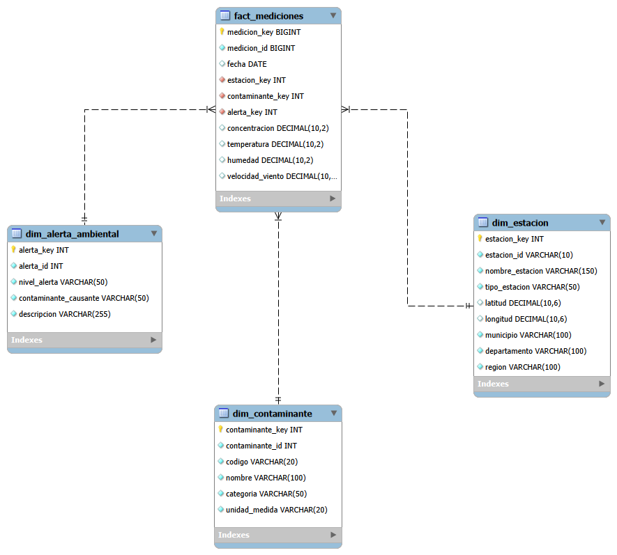

# proyecto-medallion-ambiental
Proyecto didáctico curso programación análisis de datos
# De datos sucios a un modelo confiable con SQL 📊

Proyecto final del Técnico en Programación para Análisis de Datos 
Pipeline de limpieza en MySQL con arquitectura Medallion sobre un dataset
didáctico de 100.007 mediciones ambientales.

## Arquitectura

| Capa | Qué hace | Scripts |
|------|----------|---------|
| 🥉 Bronce | Carga cruda y diagnóstico de calidad | `01_bronce/` |
| 🥈 Plata | Vistas de limpieza, validación e imputación | `02_plata/` |
| 🥇 Oro | Modelo en estrella, carga con procedimiento almacenado y pruebas QA | `03_oro/` |

## Modelo en estrella

## Decisiones de limpieza

- **Concentraciones negativas (-10 µg/m³):** el IQR no las detectó como atípicas,
  pero son físicamente imposibles. Se trataron como inválidas y se imputaron con la mediana.
- **Coordenadas imposibles (latitud 250, longitud -500):** se dejaron en NULL.
  Un promedio habría inventado una ubicación.

## Resultados

- 100.002 registros cargados de Plata a Oro (5 duplicados exactos eliminados)
- 7 pruebas de calidad superadas: volumen, conciliación, duplicados, huérfanos,
  métricas completas, dominio y coordenadas

## Cómo ejecutarlo

1. Ejecutar el script fuente para crear la base de datos original.
2. Ejecutar los scripts en orden: `01` → `02` → `03` → `04` → `05`.
3. Revisar los resultados de las pruebas QA al final del script `05`.

## Herramientas

MySQL 8 · MySQL Workbench

## Autora

Cindy Estefania Moya Blanco · [LinkedIn](https://www.linkedin.com/in/cindymoyadata/)
